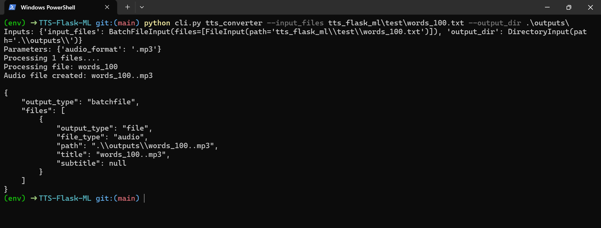

# TTS-Flask-ML



Converts text files to audio speech files. Uses pyttsx3 and wrapped by Flask-ML.

## Setup
**1. Install pipenv and start virtual env**
```
pip install pipenv
```
```
pipenv shell
```
**2. Install dependencies**

via pipenv
```
pipenv install
```
or

via requirements.txt

*Windows*
``` 
pip install -r requirements-win.txt
``` 
*MacOS*
``` 
pip install -r requirements-mac.txt
``` 

## Flask-ML
**Starting server**
```
python -m tts_flask_ml.server.server
```
**Client example**

*Update the inputs on the file before running.*
```
python -m flask_client_test
```

## Command Line Interface

**Convert one or more text files**
```
python cli.py --input_files ./text_1.txt ./text_2.txt
```

**Optional - Specify Output Directory and Audio Format**
```
python cli.py --input_files ./text_1.txt ./text_2.txt --output_dir ./output --audio_format wav
```

These CLI arguments can be tweaked as follows:
- `input_files`: List of space-separated file paths referring to text files you want to convert.
- `output_dir`: Path to directory where you want to save the resulting audio files.
- `audio_format`: Format of resulting audio files (must be one of `mp3`, `aiff`, or `wav`).

> Do not use `.mp3` format on macOS. Default on mac is `.aiff` and default on other systems is `.mp3`.

**Run Test Suite**
```
cd tts_flask_ml/test
python -m pytest
```


