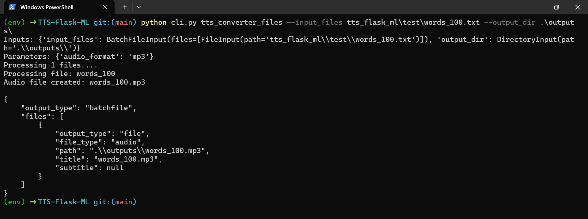

# TTS-Flask-ML



Converts text files to audio speech files. Uses pyttsx3 and wrapped by Flask-ML.

## Setup
**1. Install pipenv and Start Virtual Environment**
```
pip install pipenv
```
```
pipenv shell
```
**2. Install Dependencies**

via pipenv
```
pipenv install
```
or

via requirements.txt

*Windows*
``` 
pip install -r requirements-win.txt
``` 
*MacOS*
``` 
pip install -r requirements-mac.txt
``` 

## Flask-ML
**Starting Server**
```
python -m tts_flask_ml.server.server
```
**Client Example**

*Update the inputs on the file before running.*
```
python -m flask_client_test
```

## Command Line Interface (Run from Root)

**Convert One or More Text Files**

Sample Command:
```
python cli.py tts_converter_files --input_files tts_flask_ml\test\words_100.txt tts_flask_ml\test\words_9999.txt --output_dir ./output
```

**Convert All Text Files in Directory**

Sample Command:
```
python cli.py tts_converter_dir --input_dir tts_flask_ml\test --output_dir ./output
```

**Optional - Specify Audio Format**

Sample Command:
```
python cli.py tts_converter_dir --input_dir tts_flask_ml\test --output_dir ./output --audio_format wav
```

These CLI arguments can be tweaked as follows:

Option: `tts_converter_files`
- `input_files`: List of space-separated file paths referring to text files you want to convert.
- `output_dir`: Path to directory where you want to save the resulting audio files.
- `audio_format`: Format of resulting audio files (must be one of `mp3`, `aiff`, or `wav`).

Option: `tts_converter_dir`
- `input_dir`: Path to directory containing the text files you want to convert.
- `output_dir`: Path to directory where you want to save the resulting audio files.
- `audio_format`: Format of resulting audio files (must be one of `mp3`, `aiff`, or `wav`).

> Do not use `mp3` format on macOS. Default on mac is `aiff` and default on other systems is `mp3`.

**Run Test Suite**
```
cd tts_flask_ml/test
python -m pytest
```


